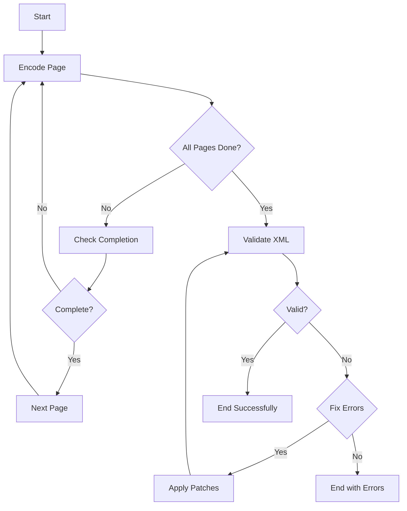

# Text Encoding Agent

A LangGraph-based agent that orchestrates the encoding of text sources into TEI XML format using AI models and automated validation/correction.

## Overview

The Text Encoding Agent is designed to automate the process of converting source texts (such as biblical texts, liturgical texts, etc.) into valid TEI XML format. It uses a multi-step workflow that includes:

1. **Page-by-page encoding** using AI models
2. **Completion verification** to ensure all content is captured
3. **XML validation** against the JLPTEI schema
4. **Automated error correction** when validation fails

## Architecture

The agent is built using LangGraph and consists of several key components:

### Core Components

- **`text_encoding_agent.py`** - Main agent implementation with LangGraph workflow
- **`source_file.py`** - AI-powered encoding functions for individual pages
- **`xml_linter.py`** - XML validation against JLPTEI schema
- **`diff_fix.py`** - Automated error correction using AI-generated patches
- **`tools.py`** - Utility functions for page retrieval
- **`common.py`** - Shared data models and configuration

### Workflow



## Usage

### Basic Usage

```python
from text_encoding_agent import TextEncodingAgentInput, run_text_encoding_agent

# Define input parameters
input_data = TextEncodingAgentInput(
    name_of_section="Genesis Chapter 1",
    name_of_source_text="1917 Jewish Publication Society Bible",
    namespace="bible",
    project_id="genesis",
    start_page=1,
    end_page=10,
    max_errors=5
)

# Run the agent
result = run_text_encoding_agent(input_data)

# Check results
if result["final_xml"]:
    print("Encoding successful!")
    print(f"XML length: {len(result['final_xml'])} characters")
else:
    print("Encoding failed with errors:")
    for error in result["encoding_errors"]:
        print(f"  - {error}")
```

### Input Parameters

- **`name_of_section`**: The name/title of the section being encoded
- **`name_of_source_text`**: The name of the source document
- **`namespace`**: Project namespace (e.g., "bible", "siddur")
- **`project_id`**: Unique identifier for the project
- **`start_page`**: Starting page number (inclusive)
- **`end_page`**: Ending page number (inclusive)
- **`max_errors`**: Maximum number of error correction attempts (default: 5)
- **`checkpoint_id`**: Optional checkpoint ID to resume from (default: None)
- **`enable_checkpointing`**: Enable checkpointing for this session (default: True)

### Output

The agent returns a state dictionary containing:

- **`final_xml`**: The complete encoded XML (if successful)
- **`encoding_errors`**: List of any errors encountered
- **`current_page`**: Last page processed
- **`error_count`**: Number of error correction attempts made
- **`messages`**: Processing log with AI explanations
- **`checkpoint_id`**: Unique identifier for this encoding session
- **`last_checkpoint_time`**: Timestamp of the last checkpoint

## Configuration

### AI Models

The agent uses the following AI models (configured in `common.py`):

- **Source encoding**: `Qwen/Qwen3-235B-A22B-Instruct-2507`
- **Error correction**: `Qwen/Qwen3-235B-A22B-Instruct-2507`

### Schema Validation

XML validation is performed against the JLPTEI schema located at:
- RelaxNG schema: `schema/jlptei.odd.xml.relaxng`
- Schematron rules: `schema/jlptei.odd.xml.schematron.xslt`

### Source Data

Source pages are expected to be located in:
- `sources/jps1917/text/` (for 1917 JPS Bible)
- Pages should be named as `0001.txt`, `0002.txt`, etc.

The `get_page` tool is used internally to retrieve pages and expects:
- Input: `{"page_number": int}` - The page number to retrieve
- Output: `Page` object with `number` and `content` fields, or `None` if not found

## Error Handling

The agent includes comprehensive error handling:

1. **Page not found**: Skips missing pages and continues
2. **Encoding failures**: Captures and reports encoding errors
3. **Validation errors**: Attempts automatic correction up to `max_errors` times
4. **Patch application failures**: Reports when error fixes cannot be applied

## Example

See `example_usage.py` for a complete working example that demonstrates:
- Setting up input parameters
- Running the agent
- Handling results and errors
- Displaying processing information

## Dependencies

- `langgraph` - Workflow orchestration
- `langchain` - AI model integration
- `pydantic` - Data validation
- `saxonche` - XML processing and validation
- `diff-match-patch` - Patch application for error correction

## Checkpointing

The agent supports in-memory checkpointing for resuming interrupted encoding sessions:

### Basic Checkpointing

```python
# Enable checkpointing (default)
input_data = TextEncodingAgentInput(
    name_of_section="Genesis Chapter 1",
    name_of_source_text="1917 Jewish Publication Society Bible",
    namespace="bible",
    project_id="genesis",
    start_page=1,
    end_page=10,
    enable_checkpointing=True  # Enable checkpointing
)

result = run_text_encoding_agent(input_data)
checkpoint_id = result["checkpoint_id"]
```

### Resuming from Checkpoint

```python
from text_encoding_agent import resume_text_encoding_agent

# Resume from a checkpoint
result = resume_text_encoding_agent(checkpoint_id)
```

### Manual Checkpoint Management

```python
from text_encoding_agent import save_checkpoint_manually, load_checkpoint_manually

# Save checkpoint to file
save_checkpoint_manually(state, "my_checkpoint.json")

# Load checkpoint from file
state = load_checkpoint_manually("my_checkpoint.json")
```

### Checkpoint Features

- **Automatic checkpointing**: State is automatically saved at each step
- **Resume capability**: Interrupted sessions can be resumed from the last checkpoint
- **Manual checkpointing**: Save/load checkpoints to/from files
- **Unique session IDs**: Each encoding session gets a unique checkpoint ID
- **Progress tracking**: Checkpoints include current page, encoding progress, and error state

## Integration

The agent can be integrated into larger workflows for:
- Batch processing multiple sections
- Integration with document management systems
- Automated quality assurance pipelines
- Human-in-the-loop review processes
- Long-running encoding tasks with interruption handling

## Troubleshooting

### Common Issues

1. **Missing pages**: Ensure source files exist in the expected directory structure
2. **Schema validation errors**: Check that the JLPTEI schema files are present and valid
3. **AI model errors**: Verify API keys and model availability
4. **Memory issues**: For large documents, consider processing in smaller chunks

### Debug Mode

Enable debug output by adding print statements or using a logger to track:
- Page processing progress
- Validation results
- Error correction attempts
- AI model responses
